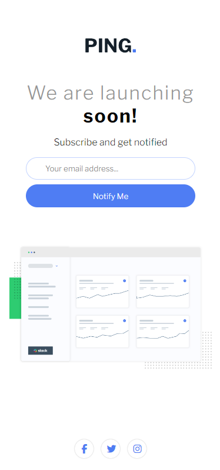

# Ping Coming Soon Page

## Overview

This project features a "Ping Coming Soon Page," designed to excite and inform visitors about an upcoming website launch. Utilizing HTML, CSS, and JavaScript, this page includes a user-friendly email subscription form with validation, ensuring that users provide a valid email address. Styled with 'Libre Franklin' font from Google Fonts and FontAwesome icons, the page combines modern design with functionality, making it perfect for building anticipation and growing an audience pre-launch.

## Features

- **Responsive Layout:** Adapts to different device screens, ensuring accessibility and user-friendliness.
- **Custom Typography:** Employs 'Libre Franklin' for its clear, readable text.
- **Email Validation:** JavaScript is used to validate the email input, displaying an error message for invalid addresses.
- **Social Media Icons:** FontAwesome icons link to social media, encouraging users to engage on multiple platforms.

## Screenshots




## Setup

To use this component in your project, follow these steps:

1. **Clone the Repository:**

```bash
git clone https://github.com/Wilmer856/ping-coming-soon-page.git
```

2. **Navigate to the Project Directory:**

```bash
cd ping-coming-soon-page-master
```

3. **Open the `index.html` file in a web browser to view the component.**

## Customization

- **Content and Images:** Replace the logo and main illustration in the images directory to align with your brand.
- **Text:** Adjust the headings and paragraph text to fit your message and launch details.
- **Styling:** Modify the 'style.css' file to tailor the color scheme, fonts, and layout to your preferences.
- **Functionality:** Enhance the email validation script in index.js or integrate the form with your email marketing service.

## Dependencies

- Google Fonts: [Libre Franklin](https://fonts.google.com/specimen/Libre+Franklin) for typography.
- Font Awesome: Social media icons provided by [FontAwesome](https://fontawesome.com/).
